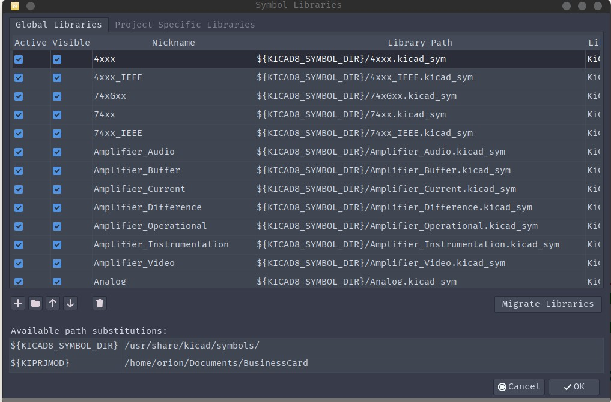
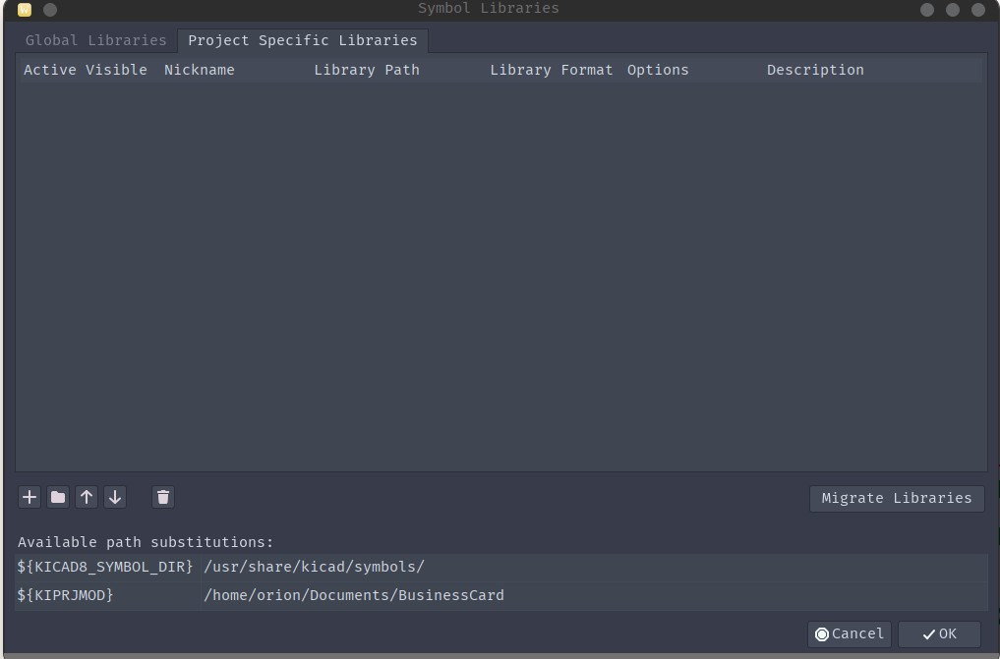
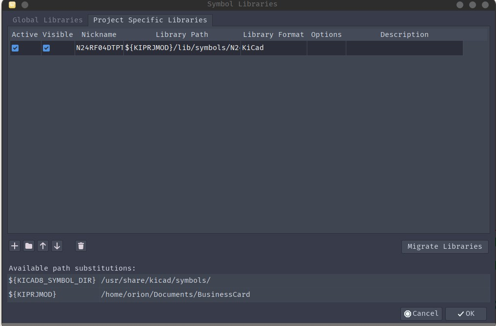

# To use the Game Port/DB15 Schematic Symbol in KiCad:
## Step 1. Download "Game_Port_Connector.kicad_sym"
This is a KiCad Schematic Symbol Library.

## Step 2. Import it into KiCad
Below is part of a tutorial from https://crablabs.io/insights/kicad-external-libraries
### Creating Local Libraries
In the folder containing the project you should create a folder that will be used as a place to store external library files. Crab Labs officially calls this folder “lib” but any name will do.

Enter this folder and create 3 separate sub-folders (one for 3-D models, one for symbols, and the last for footprints). The folder for the footprints must be named *.pretty to be recognized by KiCad. Crab Labs calls these folders “models”, “footprints.pretty”, and “symbols”

Copy the 3-D model of the component in to the 3-D model folder in the project library. Copy the kicad_sym file in to the symbol folder in the project library. Copy the kicad_mod file into the footprint folder in the project library.

Once all of the files are copied to the project local directory we want to make them available to use in the project.

### Importing Libraries into Project
Go in to the schematic editor. In the “Preferences” drop down menu there will be an option to “Manage Symbol Libraries”, click in to it.

Symbol Library Manager

Navigate to “Project Specific Libraries”

Project Specific Libraries

Click on the folder icon which is “Add From Existing File” and navigate to the kicad_sym that you just added in the library folder, click OK

Library Added

The symbol library is now added and available for use in your design. This process much be done for all kicad_sym files individually.
